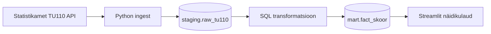

# Majutusasutuste analüüs

## Äriküsimus

Millises Eesti piirkonnas on suurim potentsiaal avada uus majutusasutus, arvestades nõudlust, täituvust ja rahalist potentsiaali?

**Mõõdikud:**

1. **Turumaht** — ööbimiste arv piirkonnas (nõudluse suurus)
2. **Nõudluse/pakkumise suhe** — ööbimised jagatud voodikohtade arvuga (kui täis majutuskohad on)
3. **Rahaline potentsiaal** — ööbimiste arv × ööpäeva keskmine maksumus

## Arhitektuur



Täpsem kirjeldus: [`docs/arhitektuur.md`](docs/arhitektuur.md)

## Andmestik

| Allikas | Tüüp | Ajas muutuv? | Roll |
|---------|------|--------------|------|
| Statistikamet TU110 | API | Jah, kord aastas | Majutusstatistika (ööbimised, täitumus, hinnad) |
| `dim_ariline_hinnang` | seed-tabel | Ei, staatiline | Ärikategooriate selgitused (4 kategooriat) |

## Stack

| Komponent | Tööriist |
|-----------|---------|
| Sissevõtt | Python (`scripts/ingest.py`) |
| Transformatsioon | SQL (`scripts/01_transform.sql`) |
| Andmehoidla | PostgreSQL (pgDuckDB) |
| Näidikulaud | Streamlit |
| Orkestreerimine | Docker Compose + shell script |

## Käivitamine

```bash
# 1. Klooni repo ja liigu kausta
git clone <repo-url>
cd ut-andmeinseneeria-projekt

# 2. Kopeeri keskkonnamuutujad
cp .env.example .env

# 3. Käivita teenused — pipeline käivitub automaatselt
docker compose up -d --build
```

Näidikulaud: **http://localhost:8501**

Pipeline käivitab andmete laadimise ja transformatsiooni automaatselt (~30 sekundit pärast käivitamist). Pipeline'i käsitsi uuesti käivitamiseks:

```bash
docker compose exec pipeline python scripts/run_pipeline.py run-all
```

## Konfiguratsioon

Kõik seaded on `.env` failis. Repos on ainult `.env.example`.

| Muutuja | Tähendus | Vaikeväärtus |
|---------|----------|--------------|
| `POSTGRES_PASSWORD` | Andmebaasi parool | `praktikum` |
| `DB_PORT_HOST` | Andmebaasi port hostis | `55432` |
| `DASHBOARD_PORT_HOST` | Näidikulaua port | `8501` |
| `API_URL` | Statistikaameti TU110 API | (vt `.env.example`) |

## Andmevoog lühidalt

1. **Sissevõtt** — `ingest.py` pärib kõik 8 näitajat TU110 API-st (JSON-stat2 formaat) ja salvestab `staging.raw_tu110` tabelisse
2. **Transformatsioon** — SQL arvutab kolm mõõdikut, normaliseerib need 0–1 skaalale ja annab igale piirkonnale lõpliku skoori ja ärikategooria
3. **Näidikulaud** — Streamlit kuvab piirkondade edetabeli, portfelligraafiku ja ärilise soovituse

## Projekti struktuur

```
.
├── README.md
├── docker-compose.yml
├── Dockerfile.app
├── .env.example
├── .gitignore
├── docs/
│   ├── arhitektuur.md
│   └── progress.md
├── init/
│   └── schema.sql              ← andmebaasi skeem
└── scripts/
    ├── ingest.py               ← andmete sissevõtt API-st
    ├── run_pipeline.py         ← pipeline orkestreerimine
    ├── run_pipeline.sh         ← automaatne käivitus konteineris
    ├── 00_seed.sql             ← ärikategooriate dimensioon
    ├── 01_transform.sql        ← skooride arvutus
    └── requirements.txt
```