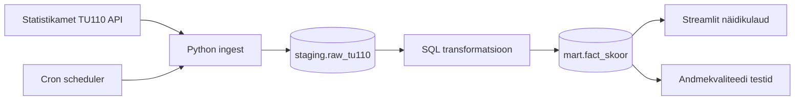

# Majutusasutuste analüüs

## Äriküsimus

Millises Eesti piirkonnas on suurim potentsiaal avada uus majutusasutus, arvestades nõudlust, nõudluse kasvu, täituvust ja rahalist potentsiaali?

**Mõõdikud ja kaalud:**

| # | Mõõdik | Kaal | Kirjeldus |
|---|--------|------|-----------|
| 1 | **Turumaht** | 30% | Aastane ööbimiste arv piirkonnas |
| 2 | **Nõudluse kasv (CAGR)** | 35% | 3-aastane liitkasvumäär |
| 3 | **Täituvus** | 20% | Ööbimised ÷ (voodikohad × 365) |
| 4 | **Rahaline potentsiaal** | 15% | Ööbimiste arv × ööpäeva keskmine maksumus (€) |

Kõik mõõdikud normaliseeritakse vahemikku 0–1 (min-max) enne kaalumist.

**Ärikategooriad:**

| Kategooria | Soovitus | Kriteerium |
|------------|----------|------------|
| Atraktiivne turg | INVESTEERI KOHE | Skoor ≥ 0.65 |
| Kasvav turg | VARAJANE SISENEMINE | CAGR kõrge, turumaht väike |
| Küllastunud turg | VÄLDI | Täituvus madal, kasv puudub |
| Stabiilne rahavoog | RAHAVOO STRATEEGIA | Muul juhul |

## Arhitektuur



Täpsem kirjeldus: [`docs/arhitektuur.md`](docs/arhitektuur.md)

## Andmestik

| Allikas | Tüüp | Ajas muutuv? | Roll |
|---------|------|--------------|------|
| Statistikamet TU110 | API | Jah, kord aastas | Majutusstatistika (ööbimised, täitumus, hinnad) |
| `dim_maakond` | mõõtmetabel | Ei, staatiline | 15 maakonda + 4 suurlinna |
| `dim_ariline_hinnang` | seed-tabel | Ei, staatiline | Ärikategooriate selgitused (4 kategooriat) |

## Stack

| Komponent | Tööriist |
|-----------|---------|
| Sissevõtt | Python (`scripts/run_pipeline.py`) |
| Transformatsioon | SQL (`scripts/01_transform.sql`) |
| Andmekvaliteet | SQL (`scripts/02_quality.sql`) — 12 automaattesti |
| Andmehoidla | PostgreSQL (pgDuckDB) |
| Näidikulaud | Streamlit |
| Orkestreerimine | Docker Compose + shell script |

## Käivitamine

```bash
# 1. Klooni repo ja liigu kausta
git clone <repo-url>
cd ut-andmeinseneeria-projekt

# 2. Kopeeri keskkonnamuutujad
cp .env.example .env

# 3. Käivita teenused — pipeline käivitub automaatselt
docker compose up -d --build
```

Näidikulaud: **http://localhost:8501**

Pipeline käivitab andmete laadimise, transformatsiooni ja kvaliteedikontrolli automaatselt (~30 sekundit pärast käivitamist). Pipeline'i käsitsi uuesti käivitamiseks:

```bash
docker compose exec pipeline python scripts/run_pipeline.py run-all
```

Muud käsud:

```bash
# Ainult sissevõtt
docker compose exec pipeline python scripts/run_pipeline.py ingest

# Ainult transformatsioon
docker compose exec pipeline python scripts/run_pipeline.py transform

# Ainult kvaliteeditestid
docker compose exec pipeline python scripts/run_pipeline.py quality-check

# Andmete lähtestamine
docker compose exec pipeline python scripts/run_pipeline.py reset
```

## Konfiguratsioon

Kõik seaded on `.env` failis. Repos on ainult `.env.example`.

| Muutuja | Tähendus | Vaikeväärtus |
|---------|----------|--------------|
| `POSTGRES_PASSWORD` | Andmebaasi parool | `praktikum` |
| `DB_PORT_HOST` | Andmebaasi port hostis | `55432` |
| `DASHBOARD_PORT_HOST` | Näidikulaua port | `8501` |
| `DASHBOARD_AUTOREFRESH_SECONDS` | Automaatne uuendamine | `5` |
| `API_URL` | Statistikaameti TU110 API | (vt `.env.example`) |

## Andmevoog lühidalt

1. **Sissevõtt** — `run_pipeline.py` pärib kõik 8 näitajat TU110 API-st (JSON-stat2 formaat) ja salvestab `staging.raw_tu110` tabelisse. Inkrementaalne laadimine: `staging.ingest_cursor` jälgib, mis aasta andmed on juba laetud. Esimesel käivitusel laaditakse 4 aastat korraga (et CAGR oleks kohe arvutatav), edaspidi 1 aasta kaupa.
2. **Transformatsioon** — SQL arvutab neli mõõdikut, normaliseerib need 0–1 skaalale ja annab igale piirkonnale lõpliku kaalutud skoori ja ärikategooria.
3. **Kvaliteedikontroll** — 12 automaattesti kontrollivad andmete olemasolu, mõõdikute korrektsust ja andmete integriteeti. Tulemused logitakse `quality.test_results` tabelisse.
4. **Näidikulaud** — Streamlit kuvab piirkondade edetabeli, tulpdiagrammi ja ärilise soovituse. Külgribal on näha kvaliteeditestide staatus.

## Projekti struktuur

```
.
├── README.md
├── docker-compose.yml
├── Dockerfile.app
├── .env.example
├── .gitignore
├── docs/
│   ├── arhitektuur.md
│   └── progress.md
├── init/
│   └── schema.sql              ← andmebaasi skeem (3 skeemi: staging, mart, quality)
├── dashboard/
│   └── app.py                  ← Streamlit näidikulaud
└── scripts/
    ├── run_pipeline.py         ← pipeline orkestreerimine
    ├── run_pipeline.sh         ← automaatne käivitus konteineris
    ├── config.py               ← API URL konfiguratsioon
    ├── 00_seed.sql             ← ärikategooriate dimensioon
    ├── 01_transform.sql        ← skooride arvutus
    ├── 02_quality.sql          ← 12 andmekvaliteedi testi
    └── requirements.txt
```
