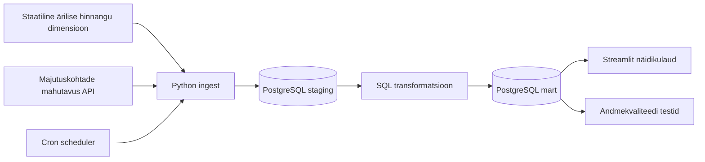

# Arhitektuur

## Äriküsimus

Millises Eesti piirkonnas on kõige suurem potentsiaal avada uus majutusasutus, arvestades nõudlust, nõudluse kasvu ja tasuvust?

## Mõõdikud

1. Kui suur on piirkonnas nõudluse kasv? (näitab, kas piirkond on alles arenev ehk potentsiaalselt paremad hinnad ostmisel)

CAGR - (ööbimiste arv 2025 / ööbimiste arv 2022 ) astmes 1/3 - 1

2.  Millises Eesti piirkonnas on kõige suurem potentsiaal?

1.1. Kui suur on ööbijate arv piirkonnas? (näitab, kas piirkonnas on üldse turgu)

Päring tabelist majutuskohtade mahutavus: Ööbimiste arv

1.2. Kui suur on piirkonnas nõudluse kasv? (näitab, kas piirkond on alles arenev ehk potentsiaalselt paremad hinnad asutusele)

CAGR - (ööbimiste arv 2025 / ööbimiste arv 2022 ) astmes 1/3 - 1

1.3. Milline on nõudlus piirkonniti? (näitab, kas piirkonnas oleks vaja ööbimiste arvu arvestades veel majutuskohti)

Ööbimised/voodikohtade arv

1.4 Milline on rahaline potentsiaal piirkonniti?

Ööbimiste arv * ööpäeva keskmine maksumus

Tulemus = W1 * Ööbimiste arv + W2 * Nõudluse kasv (CAGR) + W3 ​* Nõudlus + W4 * Rahaline potentsiaal

## Tabelid:

1. Majutuskohtade mahutavus |
https://andmed.stat.ee/et/stat/majandus__turism-ja-majutus__majutus/TU110/table/tableViewLayout2

Näitajad:
Majutuskohtade arv
Tubade arv
Voodikohtade arv
Tubade täitumuse %
Voodikohtade täitumise %
Ööpäeva keskmine maksumus
Maakond
Vaatlusperiood (aasta)
Majutatute arv (mitu inimest jäi ööseks)
Ööbimiste arv (mitu ööd nad ööbisid)

2. Staatiline tabel - äriline hinnang piirkonnale

|kategooria_id|	kategooria_nimi|	soovitus|	selgitus|
|---------|------|--------------|------|
|1	|Atraktiivne turg|	INVESTEERI KOHE|	 kõrge nõudlus, pakkumise vajadus ja kasv|
|2	|Kasvav turg|	VARAJANE SISENEMINE|	väike turg, aga kiire kasv ja potentsiaal|
|3	|Küllastunud turg|	VÄLDI| pakkumine ületab nõudlust, kasv puudub|
|4	|Stabiilne rahavoog|	RAHAVOO STRATEEGIA|	stabiilne turg, vähe kasvu, aga kindel täituvus|

## Andmeallikad

| Allikas | Tüüp | Ajas muutuv? | Roll |
|---------|------|--------------|------|
| Majutuskohtade mahutavus | API | Jah, iga aasta | Info majutuskohtade mahutavusest |
| Ärilise hinnangu defineerimine | dim-tabel | Ei, staatiline | Abitabel piirkonnas sobivuse hindamiseks|

## Andmevoog

## Andmebaasi kihid

| Kiht | Roll |
|------|------|
| `staging` | Hoiab allika andmeid töötlemata kujul. |
| `mart` | Hoiab transformeeritud ja äriloogikat sisaldavaid tabeleid. |

## Tööjaotus

| Roll | Vastutus | Täitja |
|------|----------|--------|
| Andmeallika omanik | Kirjutab sissevõtu loogika, hoiab API-t töös | Elin ja Erik |
| Transformatsioonide omanik | Kirjutab mart kihi mudelid ja mõõdikute arvutuse | Elin ja Hanna |
| Kvaliteedi omanik | Kirjutab testid ja vaatab läbi ebaõnnestunud kontrollid | Hanna ja Erik |
| Näidikulaua omanik | Ehitab näidikulaua ja seob selle äriküsimusega | Elin ja Hanna ja Erik |

## Riskid

| Risk | Mõju | Maandus |
|------|------|---------|
| API andmed uuenevad kord aastas | Keeruline on testida pidevat ajas uuenemist ja seega andmetoru kvaliteeti | Lisame juurde testandmeid ajas uuenemise testimiseks |
| Mõõdikute tulemus ei vasta reaalsele olukorrale | Tulemust ei saa päriselus rakendada | Mõõdikute kaalud tuleb ümber teha|
| Leian paremad algallikad | Pean mõõdikud ümber tegema, sest enam pole vaja arvutada | Otsida kohe põhjalikumalt andmetabeleid|

## Privaatsus ja turve

Projektis ei esine tundlikke andmeid, seega eriliike andmete kaitset ei ole vaja. Isikuandmeid ei töötle. Andmebaasi paroolid peavad tule .env failist. Git-i projekti nägemise õigused on jagatud ainult valitud kasutajatele.
