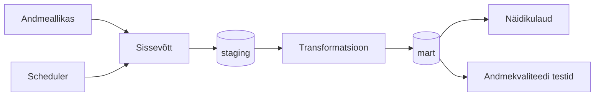

# Arhitektuur

> **Juhend:** See fail on projektitöö esimese nädala väljund. Asenda kõik nurksulgudes plankid oma projekti tegeliku sisuga. Kustuta see juhendrida.

## Äriküsimus

Milline ajaline tegur mõjutab muusikastiili (žanri) valikut täpsemalt: kellaeg või igakuine kuulamistrend?

## Mõõdikud

1. Žanrijaotuse erinevus päevaaegade lõikes (per aasta)

Arvutuskäik: 

Info kasutaja kuulamistest (lugu + artist + kellaaeg), tuleb läbi esimese allika - Spotify API.
Vastavalt artistile saame teada žanri, mille alla see lugu kuulub (staatiline žanr -> artist vastavustabel)
Vastavalt kellaajale saame liigitada kuulamised päevaaegade järgi (staatiline päevaaega vastavustabel)
Teeme päringu, milliseid žanre kuulati vastavalt päevaaegadele
Saame 

2. Žanrijaotuse erinevus üldisest aasta-kuulamisest kuude lõikes

Arvutuskäik:

3. Kahes kontekstis žanri jaotuse hälve võrdlus

Arvutuskäik:

## Andmeallikad

| Allikas | Tüüp | Ajas muutuv? | Roll |
|---------|------|--------------|------|
| [Nimi] | [API / CSV / DB] | Jah, [iga X tundi / päeva] | [Milleks kasutatakse?] |
| [Nimi] | [seed / dim-tabel] | Ei, staatiline | [Milleks kasutatakse?] |

## Andmevoog

> Täpsusta diagrammi vastavalt oma projektile — lisa rohkem andmeallikaid, mudeleid või teenuseid.

## Andmebaasi kihid

| Kiht | Roll |
|------|------|
| `staging` | Hoiab allika andmeid töötlemata kujul. |
| `mart` | Hoiab transformeeritud ja äriloogikat sisaldavaid tabeleid. |

## Tööjaotus

| Roll | Vastutus | Täitja |
|------|----------|--------|
| Andmeallika omanik | Kirjutab sissevõtu loogika, hoiab API-t töös | [Nimi] |
| Transformatsioonide omanik | Kirjutab mart kihi mudelid ja mõõdikute arvutuse | [Nimi] |
| Kvaliteedi omanik | Kirjutab testid ja vaatab läbi ebaõnnestunud kontrollid | [Nimi] |
| Näidikulaua omanik | Ehitab näidikulaua ja seob selle äriküsimusega | [Nimi] |

## Riskid

| Risk | Mõju | Maandus |
|------|------|---------|
| [Risk 1 — näiteks: API ei vasta] | [Mis juhtub?] | [Kuidas maandad?] |
| [Risk 2] | [Mis juhtub?] | [Kuidas maandad?] |
| [Risk 3] | [Mis juhtub?] | [Kuidas maandad?] |

## Privaatsus ja turve

[Kirjelda, millised isiku- või tundlikud andmed teie projektis esinevad (kui üldse) ja kuidas neid kaitsete. Isikuandmed peavad olema anonümiseeritud. Andmebaasi paroolid peavad tulema `.env` failist.]